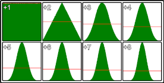

# Singing crowd
## Context & purpose
As shown by [this video](https://youtu.be/lWFq8uILaq4) [FR] from the YouTube channel [Fouloscopie](https://www.youtube.com/channel/UCLXDNUOO3EQ80VmD9nQBHPg), there seems to be a phenomenon that leads crowds to sing better than its individual components.

In the video, two possible explanations are given:
* the bad singers adapt while hearing the good singers and sing better;
* even with bad singers in the crowd (which we can here by coming closer to individuals), there's a kind of *audition illusion* of our brain that interprets the right note when it hears many notes around it.

Let's forget about the first explanation, and try to explain why, even with people singing effectively bad, the crowd is in tune.

"Sing better" can be very subjective. Here, we simply consider the fact of being in tune, which can, on an individual, be quantified by the distance between the effective and the expected frequency. On a crowd (≥2 people), it is more difficult. Taking a mean between the two frequencies has no physical meaning. So the appreciation is much subjective.

For a higher number of people (actually ≥5), the density distribution of the frequencies can bring back a physical consideration: if most of the sound power concentrates tightly enough around the right frequency (let's call it acceptability range), the ratio `signal / noise` (noise consists of the signals outside the acceptability range) will be high enough to make it a pretty good note. This explanation can simply be summarized with the following: there are still more people singing well than people singing bad, so the latter won't spoil the result.

Though, if the distribution is uniform, this won't happen.

So the question is: **does a crowd sing better than single individuals even with a uniform distribution?** If yes, is the difference of quality comparable with the improvement given a slight concentration of good singers?

## Pitch test
We play with the well known *Happy birthday* song with one or several voices. At each note, for each voice, we disturb its frequency randomly higher or lower in a given range and with a given distribution. All voices and all notes, for a given recording, have the same range and distribution.

The test consists of hearing two recordings and tell which one sounds better. The two recordings have the same randomly defined range, and the same randomly defined distribution or number of voices, with a different, respectively, number of voices or distribution.

[Answer the test!](https://giulioforesto.github.io/singing-crowd/index.html) [FR]

## Dev
### Build
* Build dependencies
* Copy `node_modules/tone/build/Tone.js` (referenced in `package.json`) in the `script` folder.
